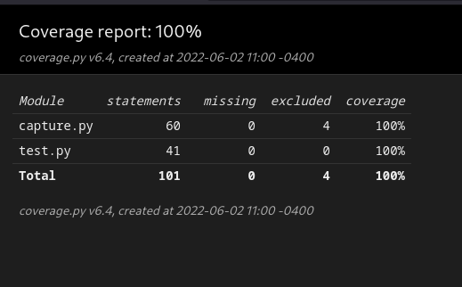
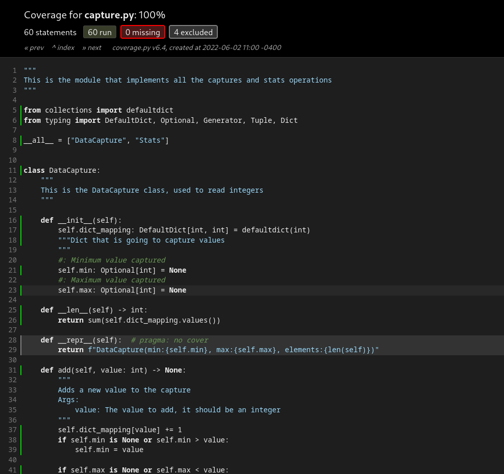
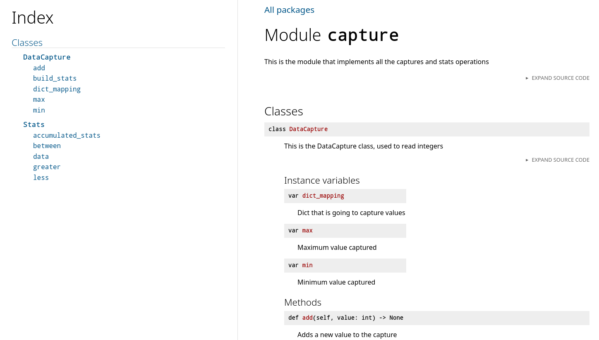

# Data Capture Technical Challenge

## Introduction

This is a technical challenge that involves capturing integers and then building stats wih them.

## Setup

### Requirements

In order to setup you will need:

- `Python 3.10`, although this can work with earlier version but it hasn't been tested
- `pipenv` as a virtual environment manager
  `pipenv` install instructions by platform can be found [here](https://pipenv.pypa.io/en/latest/#install-pipenv-today)

### Install process

- Make sure you have installed `python` and `pipenv`
- In the repo directory, do a `pipenv shell` command in order to create a virtual environment

   > **Tip** 💡: If you are in a UNIX-like operating system you can do `which python` to make sure you are not using the `python` installation of your system
- Run `pipenv install`
- And now you are done 😊

## Running

There are different commands that can run the app, they are specified within the `[scripts]` section of `Pipfile`.

> ⚠️ **Note that you need to have your pipenv environment activated in order to run them**

### Main

Invoked with either `pipenv run main` or with `python main.py`. This is a command that runs a sample `DataCapture` instance with 5 numbers captured and then it build stats from there are shown. An example output of this is

```text
Capturing: DataCapture(min:3, max:9, elements:5)
stats.less(4)=2
stats.between(3, 6)=4
stats.greater(4)=2
```

### Test

This command runs tests without generating comprehensive reports about it. To invoke this run `pipenv run test`.

> 💡 Tests internally use [pytest](https://docs.pytest.org/en/7.1.x/index.html)

### Format

Invoked using `pipenv run format` it internally invokes [black](https://github.com/psf/black) to format the code using [PEP-8](https://peps.python.org/pep-0008/) standards.

### Test coverage

`pipenv run test-coverage` creates a coverage report. Uses [coverage](https://coverage.readthedocs.io/en/6.4.1/) package internally.

### Coverage report

`pipenv run coverage-report` prints a coverage report, like the following:

```text
Name         Stmts   Miss  Cover
--------------------------------
capture.py      60      0   100%
test.py         41      0   100%
--------------------------------
TOTAL          101      0   100%
```

### Coverage HTML

`pipenv run coverage-html` generates an HTML version of the coverage report. It's saved in the `htmlcov` directory.

### Serve coverage html

`pipenv run serve-coverage-html` spins a `http.server` in the `htmlcov` directory.

---

It should look a bit like this:

Index of reports            |  Coverage report
:-------------------------:|:-------------------------:
  |  

> ⚠️ **Note**: This command should be run after running `pipenv run coverage-html`

### Generate docs

Documents can be generated with the help of [docstring conventions](https://peps.python.org/pep-0257/) and [pdoc3](https://pdoc3.github.io/pdoc/) using the command `pipenv run gen-docs`, the docs are then saved in _Markdown_ format in the `docs` directory.

> ⚠️ Note that if the documents are already generated in the `docs` folder you will need to either delete this folder to generate them again or use a `-f` flag to **force** the regeneration of the docs as in `pipenv run gen-docs -f`. **Use this with care**.

### Serve docs

In order to get nice HTML docs run `pipenv run serve-docs` which will run a server serving HTML in the port `5000` of your `localhost`. These docs will look like the following



## Misc

### Run test helper

There's a `run_test.sh` file that allows you to run the tests and generate the coverage reports.

With the `--serve` flag, you can serve these coverage reports automatically after running all the tests.